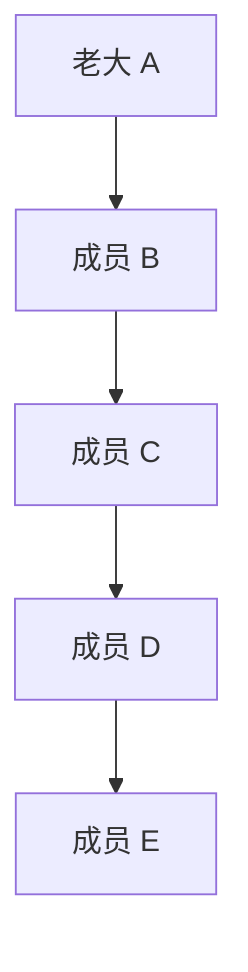
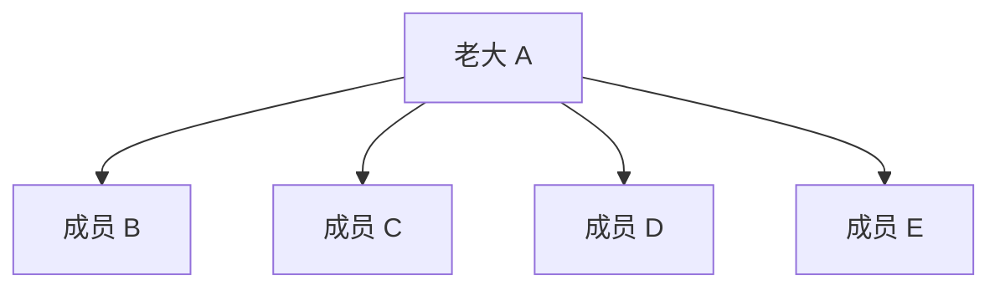

# [mid] #0200 岛屿数量 

## 题目

本质就是计算图的连通分量个数。

## 思路

### 解法一：DFS

 - 遍历 `arr[][]` 中每个格子
   - 如果当前格子为岛屿，DFS 将其周围的陆地置为海洋，numIsland++

---

### 解法二：BFS

 - 用队列维护

---

### 解法三：并查集

    - 将每个岛屿的格子视为一个节点
    - 遍历 `arr[][]` 中每个格子
    - 如果当前格子为岛屿，将其与周围的陆地节点合并
    - 最后统计并查集中的根节点数量

#### （补充）并查集的路径压缩


##### 一、没有路径压缩的世界（效率很低）

想象一个社团，有很多成员。每个成员只认识自己的“直接上级”。社团的“老大”就是他自己就是自己的上级。

比如，社团结构是这样的：
**E** 认识 **D**，**D** 认识 **C**，**C** 认识 **B**，**B** 认识社团老大 **A**。

这个关系链就像一棵“瘦高”的树：



现在，你想知道 **E** 的老大是谁。你怎么做？

1.  你问 E：“你老大谁？” E 说：“是 D。”
2.  你再问 D：“你老大谁？” D 说：“是 C。”
3.  你再问 C：“你老大谁？” C 说：“是 B。”
4.  你再问 B：“你老大谁？” B 说：“是 A。”
5.  最后你问 A：“你老大谁？” A 说：“我自己就是老大。”

找到了！E 的老大是 A。但这个过程太慢了，你问了4次才找到。如果这个链条有100个人，你就得问99次。

##### 二、引入“路径压缩”（效率极高）

路径压缩就是为了解决上面那个“问话链条”太长的问题。它的核心思想是：

**在我帮你找老大的过程中，顺手把所有问过的人都直接介绍给老大。这样下次他们再找老大，一步就到位了！**

还是刚才那个例子：`A <- B <- C <- D <- E`

你再次出发，想知道 **E** 的老大是谁。这次你一边找，一边做“路径压缩”：

1.  你从 E 开始往上找，一路经过了 D、C、B，最终找到了老大 A。
2.  在你返回告诉 E 结果的**路上**，你对每一个你问过的人说：“别再记你原来的上级了，我直接告诉你，你们的老大是 **A**！”

于是，社团的结构就发生了翻天覆地的变化：

  * E 不再只认识 D，它现在直接认识了老大 **A**。
  * D 也不再只认识 C，它现在直接认识了老大 **A**。
  * C 也不再只认识 B，它现在直接认识了老大 **A**。
  * B 原本就认识 A，保持不变。

现在，社团的结构图从一条长链变成了一棵“矮胖”的星形树：



**这样做的好处是什么？**

下次你再问 E 的老大是谁，E 会立刻告诉你：“是 A！”。你只需要问一次！同样，问 D、C、B，他们也都能一次性回答。

这就是**路径压缩**：在**查找（Find）** 的过程中，将查找路径上的所有节点直接指向根节点（老大），从而“压缩”了路径长度，极大地提高了后续查找的效率。

##### 三、再来看代码

现在我们来看那段如魔法般的代码：

```cpp
int find(int i) {
    // 如果 i 的父节点不是它自己，说明它还不是老大
    if (parent[i] != i) {
        // 这就是路径压缩的核心！
        // 递归地去查找i的父节点的最终老大，
        // 并且把查找结果（最终老大）直接赋值给 i 的父节点。
        parent[i] = find(parent[i]);
    }
    // 返回 i 的最终老大
    return parent[i];
}
```

我们来分解 `parent[i] = find(parent[i]);` 这一行：

1.  `find(parent[i])`：这是一个递归调用。它会一直往上找，直到找到最终的老大，然后把这个老大的编号返回。
2.  `parent[i] = ...`：这个赋值操作，就是实现“路径压缩”的关键。它把上一步递归找到的**最终老大**，直接设置为 `i` 的父节点。

当递归从最深层（找到了老大）开始返回时，沿途的每一个节点 `i` 都会执行 `parent[i] = [最终老大]` 这个操作，从而把整个查找路径都“拉平”了。

### 总结

  * **目的**：让查找操作变得飞快
  * **方法**：在查找一个元素的根节点时，把查找路径上经过的所有节点都直接连接到根节点上
  * **效果**：将原本可能很深的树结构变得非常扁平，后续对这些节点的查找操作几乎是瞬间完成


#### （补充）并查集的按秩合并

简单来说，**“秩”的作用是在合并两个集合时，做出最明智的选择，主动地防止树变得“瘦高”。**

我们还是用“社团”的比喻来解释。

##### 一、没有“秩”的合并（愚蠢的合并）

假设现在有两个独立的社团，我们要把它们合并成一个。

  * **社团 A**: 只有老大 A 自己，是一个光杆司令。
  * **社团 B**: 有一个老大 B，下面还有99个小弟，形成了一个很长的链条。

现在要合并 A 和 B。如果没有“秩”这个概念来指导，我们可能会随机合并。假设我们不巧，做了个最坏的决定：**让社团 B 的老大 B，去认社团 A 的老大 A 做老大。**

`A <- B <- 小弟1 <- 小弟2 <- ... <- 小弟99`

结果是什么？我们把一个只有1个人的小社团，加到了一个有100个人社团的**顶部**，让整个链条变得更长了（101层）！这会让未来的“找老大”（Find操作）变得更慢。

##### 二、引入“秩”（聪明的合并）

“秩”就像是衡量每个社团“规模”或“层级”的指标。在并查集中，`rank` 通常指树的高度。

**合并规则（按秩合并 Union by Rank）：** 在合并两个社团时，永远是“小社团”并入“大社团”，即**层级低的树（rank小）的根节点，指向层级高的树（rank大）的根节点。**

回到刚才的例子：

  * **社团 A**: 老大是 A。它只有一层，所以 `rank(A) = 0`。
  * **社团 B**: 老大是 B。它有100层，所以 `rank(B) = 99`。

现在要合并 A 和 B。根据“按秩合并”的规则：
`rank(A)` (0) \< `rank(B)` (99)，所以应该让层级低的 A 并入层级高的 B。也就是，让 A 的老大（就是A自己）去认 B 的老大（就是B自己）做老大。

`B <- A`

合并后的新社团，老大依然是 B。看看发生了什么：

  * 整个社团的高度没有增加！它还是100层。我们只是把那个光杆司令 A 挂在了 B 的下面。
  * 未来查找 A 的老大，也只需要两步（A -\> B）。

通过使用“秩”，我们做出了一个聪明的决策，**避免了树高度的无谓增长**。

###### 特殊情况：两个社团一样大怎么办？

如果两个社团的 `rank` 相同，比如都是3。那么谁并入谁都可以。假设让 A 并入 B。那么合并后，新社团的老大是 B，但它的总高度就从3层变成了4层。所以，**只有在两个 `rank` 相等的树合并时，新树的 `rank` 才会加 1。**

##### 三、看代码如何实现“聪明的合并”

```cpp
void unite(int x, int y) {
    int rootx = find(x);
    int rooty = find(y);
    if (rootx != rooty) {
        // 按秩合并的逻辑开始
        if (rank[rootx] < rank[rooty]) {
            // 如果 x 所在树的高度小于 y 所在树
            // 就把 x 的根指向 y 的根。树的总高度不变。
            parent[rootx] = rooty;
        }
        else if (rank[rootx] > rank[rooty]) {
            // 如果 y 所在树的高度小于 x 所在树
            // 就把 y 的根指向 x 的根。树的总高度不变。
            parent[rooty] = rootx;
        }
        else {
            // 两棵树一样高
            // 让 y 并入 x (反之亦可)
            parent[rooty] = rootx;
            // 新树的高度要加 1
            rank[rootx] += 1;
        }
        --count;
    }
}
```

*LeetCode 提供的代码用了一个 `swap` 小技巧来简化 `if/else`，但逻辑是完全一样的。*

##### 总结：两大优化，强强联手

现在你可以看到并查集的两个核心优化是如何协作的了：

1.  **按秩合并 (Union by Rank)**:

      * **时机**: 在 `unite` (合并) 时发生。
      * **作用**: 主动决策。像一个聪明的管理者，在合并时总选择最优结构，**从源头上防止树变得过高**。

2.  **路径压缩 (Path Compression)**:

      * **时机**: 在 `find` (查找) 时发生。
      * **作用**: 被动修正。像一个勤劳的助理，在查找时顺手把汇报路径缩短，**“事后”修复过长的路径**。

当这两个优化同时使用时，并查集每个操作的平均时间复杂度可以达到 **近乎 O(1)**，使其成为解决连通性问题的超高效算法。
